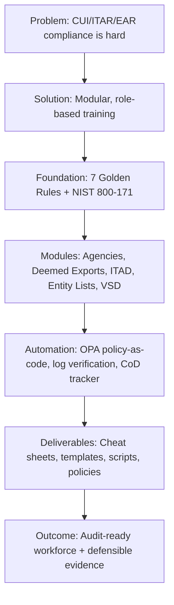

```markdown
# ITAR, EAR & CUI Compliance Training
## Zero to Hero — 120 Minutes | Defense Industrial Base Edition


> **📌 This is a living framework.** Not a static document. Not legal advice. A practical, operational system for defense compliance.

---
## Start Here (5-Minute Tour)

New to the repository? Start here:

1. 📖 **Read the training script** → [`01-training-materials/complete-training-script.md`](01-training-materials/complete-training-script.md)
2. 🏗️ **Review the multi-system SSP strategy** → [`02-templates/multi-system-ssp-strategy.md`](02-templates/multi-system-ssp-strategy.md)
3. 🤖 **Explore OPA policy-as-code** → [`06-automation/policies/cui-detection.rego`](06-automation/policies/cui-detection.rego)
4. 🖼️ **View architecture diagrams** → [`07-architecture-diagrams/`](07-architecture-diagrams/)
5. 📊 **Review success metrics** → [Success Metrics section](#success-metrics)

**5 minutes. Then you'll understand the whole framework.**
## What This Is

A complete, jargon-free compliance training program for defense contractors handling Controlled Unclassified Information (CUI), ITAR technical data, and EAR-controlled items. Built for real workflows, tested against audit scenarios, and designed to be delivered by anyone—not just lawyers.

**Duration:** 120 minutes (2 hours)  
**Audience:** All employees (Tier 1), with role-based extensions for engineers, compliance staff, and leadership  
**Format:** Live presentation + interactive quiz + cheat sheets + policy templates + automation scripts  
**Assessment:** 15-question audit-ready quiz (12/15 to pass)  
**Certification:** Certificate of completion issued upon passing

---

## What This Is NOT

| ❌ Not This | ✅ But This |
|------------|------------|
| A legal interpretation of ITAR/EAR | A practical guide to operational compliance |
| A replacement for legal counsel | A tool to help you ask better questions of counsel |
| A one-size-fits-all policy | A framework you adapt to your risk tolerance |
| A substitute for C3PAO assessment | Preparation that makes your assessment defensible |
| A static PDF | A living repository you can fork, improve, and contribute to |

---

## Why I Built This

Most compliance training is either:
- **Too dense** (500 pages of regulation, good luck)
- **Too shallow** ("don't share data with bad guys—you're done")
- **Too disconnected** from what engineers actually do

This program is different. It's built for real workflows, tested against audit scenarios, and designed to be delivered by anyone—not just lawyers.

**The goal:** Compliance shouldn't require a law degree. It should fit on a cheat sheet.

---

## Core Architecture



---

## Module Structure (120 Minutes)

| Module | Topic | Slides | Time | Key Deliverable |
|--------|-------|--------|------|----------------|
| **Opening** | Intro, agenda, why this matters | 1-3 | 5 min | Agenda set |
| **1** | The Three Agencies (DDTC, BIS, OFAC) | 4-7 | 10 min | Agency cheat sheet |
| **1B** | CUI Categories & FCI vs. CUI | 3B, 3C | 5 min | CUI identification guide |
| **2** | Controlled Items & Deemed Exports | 8-11 | 10 min | Deemed export understanding |
| **2B** | EAR Deep Dive (De Minimis, FDP, Fundamental Research) | 11B-D | 10 min | EAR rules quick reference |
| **3** | The 7 Golden Rules + Access + Asylum Risk | 12-17 | 15 min | Access policy + asylum risk memo |
| **3C** | CUI Disposal & ITAD (NIST SP 800-88) | 17B-E | 10 min | ITAD quick reference + vendor scorecard |
| **4** | Violations & Consequences | 18-20 | 10 min | Voluntary disclosure procedure |
| **4B** | Entity List, Denied Parties & Supplier Screening | 20B-E | 10 min | Restricted party screening guide |
| **5** | Recordkeeping & Continuous Monitoring | 21-24 | 5 min | Logging requirements checklist |
| **5B** | Recordkeeping Specifics + VSD | 23B-C | 5 min | VSD timeline + documentation guide |
| **6** | Scenario Quiz (15 questions) | 25-27 | 15 min | Knowledge assessment + answer key |
| **7** | DIB Technical Realities (Engineers + Compliance) | 28-32 | 10 min | "Innovation vs. Compliance" decision framework |
| **Close** | Q&A, certificates, resources | 33-34 | 5 min | Certificate of completion |
| **TOTAL** | | **34 slides** | **120 min** | **Complete training package** |

---

## Role-Based Training Tracks

This framework scales to your organization. Choose the track that fits your audience:

| Track | Audience | Duration | Focus |
|-------|----------|----------|-------|
| **Tier 1: All Employees** | Everyone | 45 min | Basics: agencies, deemed exports, 7 Golden Rules, red flags |
| **Tier 2: Managers** | Program managers, team leads | 60 min | Tier 1 + approval authority, risk acceptance, escalation paths |
| **Tier 3: Engineers** | Software, hardware, test engineers | 90 min | Tier 1 + technical controls, CUI boundary enforcement, ITAD workflows |
| **Tier 4: Compliance Team** | Compliance officers, FSOs, legal | 2 hours | Full deck + regulation deep dives, VSD drafting, audit defense |
| **Tier 5: Leadership** | Executives, board members | 30 min | Strategic overview: risk tolerance, resource allocation, liability |

---

## Key Deliverables (Checked = Ready)

- [x] **34-slide presentation outline** (`01-training-materials/slides-outline.md`)
- [x] **Full presenter script** (`01-training-materials/complete-training-script.md`) — 120 minutes, word-for-word
- [x] **7 Golden Rules cheat sheet** (`01-training-materials/cmmc-level1-cheat-sheet.pdf`) — printable, laminate-ready
- [x] **DIB Essentials one-pager** (`01-training-materials/dib-essentials-one-pager.pdf`) — quick reference for engineers
- [x] **ITAD Quick Reference** (`01-training-materials/itad-quick-reference.pdf`) — NIST SP 800-88 disposal guide
- [x] **15-question quiz** (`02-quiz/questions.md`) — audit-ready, with answer key and explanations
- [x] **ITAD vendor questionnaire** (`03-templates/itad-vendor-questionnaire.md`) — procurement screening tool
- [x] **ITAD vendor scorecard** (`03-templates/itad-vendor-scorecard.md`) — quantitative comparison template
- [x] **Certificate of Destruction template** (`03-templates/certificate-of-destruction-template.md`) — required document
- [x] **Chain of Custody template** (`03-templates/chain-of-custody-template.md`) — required document
- [x] **Asylum risk policy memo** (`04-policies/asylum-risk-policy.md`) — risk-based access standard
- [x] **Voluntary disclosure procedure** (`04-policies/voluntary-disclosure-procedure.md`) — VSD workflow
- [x] **Entity lists guide** (`05-references/entity-lists-guide.md`) — who you cannot sell to
- [x] **Red flags checklist** (`05-references/red-flags-checklist.md`) — Know Your Customer guide
- [x] **Python scripts** (`06-automation/scripts/`) — log verification, CoD tracker
- [x] **OPA policy examples** (`06-automation/policies/`) — CUI detection rules
- [x] **GitLab CI template** (`06-automation/gitlab-ci-templates/compliance-gates.yml`) — automated compliance gates
- [ ] **PDF cheat sheets** — create from Canva/Google Docs before delivery (placeholders included)

---

## Key Concepts Covered

| Concept | Source | Summary |
|---------|--------|---------|
| **DDTC / ITAR / USML** | 22 CFR 120-130 | Military items, State Department, strictest controls |
| **BIS / EAR / CCL** | 15 CFR 730-774 | Dual-use items, Commerce Department, de minimis thresholds |
| **OFAC / SDN List** | 31 CFR | Sanctions, embargoed countries, restricted parties |
| **Deemed Export** | ITAR §120.17, EAR §734.15 | Showing ITAR data to foreign national = export to their country |
| **De Minimis Rule** | EAR §734.4 | 25% threshold for most countries; 0% for embargoed |
| **Fundamental Research Exclusion** | EAR §734.8 | Publication restrictions may void exclusion |
| **Foreign Direct Product (FDP) Rule** | EAR §734.9 | U.S. tools abroad create export liability |
| **CUI (125+ categories)** | CUI Registry (NARA) | All ITAR/EAR data is CUI; not all CUI is ITAR/EAR |
| **FCI vs. CUI** | FAR 52.204-21 vs. NIST 800-171 | FCI = basic; CUI = enhanced (NIST 800-171) |
| **U.S. Person** | ITAR §120.15 | Citizens, green cards, asylees (legal) / asylees (conditional per policy) |
| **Asylum Risk Gap** | Operational policy | Provisional status + no real-time USCIS feed = monitoring gap |
| **7 Golden Rules** | NIST 800-171 | Know data, know people, know vendors, control access, encrypt, log, train |
| **CUI Marking** | NIST 800-171 | CUI//ITAR or CUI//EAR on every page, top and bottom |
| **Encryption** | FIPS 140-2 | Validated crypto for data at rest and in transit |
| **Logging (5-year rule)** | ITAR §122.5, EAR §762 | Who, what, when, where, action; retain 5 years |
| **CUI Disposal / ITAD** | NIST SP 800-88 | Clear (reuse), Purge (transfer), Destroy (retire) |
| **Entity List** | EAR §744.11, Supp 4 | License required for exports to listed entities |
| **Denied Persons List** | EAR §744 | Cannot participate in any export transaction |
| **Unverified List** | EAR §744.15 | Additional documentation required |
| **MEU List** | EAR §744.21 | Military end-user restrictions |
| **Voluntary Self-Disclosure (VSD)** | EAR §764.5, ITAR §127.12 | Disclose within 60 days for penalty reduction |
| **Red Flags (Know Your Customer)** | EAR §732 Supp 3 | Unusual routing, cash payments, unfamiliar end users |
| **ITAR Violations** | ITAR §127.3 | Up to $1M + 20 years per violation |
| **Recordkeeping Failure** | ITAR §122.5, EAR §762 | Up to $50k per violation per day |
| **Technology Control Plan (TCP)** | ITAR §124.8(3) | Required for foreign national access to ITAR data |
| **Continuous Monitoring** | NIST 800-171 | Real-time alerts for access violations |
| **AWS Nitro Enclaves** | AWS Documentation | Hardware-isolated environments for CUI processing |
| **OPA Policy-as-Code** | Open Policy Agent | Enforceable technical contracts for compliance |

---

## Technical Depth: Automation & AI

This isn't just training—it's a technical framework you can deploy.

### AWS Nitro Enclaves for CUI Processing
```yaml
# 06-automation/nitro-enclaves/enclave-config.yaml
EnclaveName: cui-processing-enclave
ParentInstance: m5.large
Memory: 2048
CPU: 2
Egress: disabled
Ingress: enabled
Attestation: required
CUIProcessing: true
```
- **Why it matters:** Hardware-isolated environments prevent CUI leakage to parent instance
- **Compliance link:** SC.L2-3.13.8 (cryptographic protection), MP.L2-3.8.1 (media protection)

### OPA Policy-as-Code for CUI Detection
```rego
# 06-automation/policies/cui-detection.rego
package compliance.cui

import input.file.content
import input.file.path

# Block commits containing ITAR markers
deny[msg] {
    content := input.file.content
    path := input.file.path
    containsITAR(content)
    not isApprovedPath(path)
    msg := sprintf("ITAR-controlled data detected in %v", [path])
}

containsITAR(content) {
    regex.match("(?i)(ITAR|CUI//ITAR|USML|DDTC)", content)
}
```
- **Why it matters:** Automated enforcement at commit time, not audit time
- **Compliance link:** AC.L2-3.1.3 (CUI flow control), CM.L2-3.4.2 (configuration change control)

### GitLab CI Compliance Gates
```yaml
# 06-automation/gitlab-ci-templates/compliance-gates.yml
stages:
  - compliance

cui-scan:
  stage: compliance
  script:
    - opa eval --data policies/ --input file.json "data.compliance.cui.deny"
  rules:
    - if: $CI_COMMIT_BRANCH == "main"
  allow_failure: false
```
- **Why it matters:** Fail fast, fix early—compliance as code, not paperwork
- **Compliance link:** CM.L2-3.4.1 (baseline configurations), SI.L2-3.14.1 (flaw remediation)

---
## Example Assessment Evidence

> **What assessors actually look for.** This folder contains illustrative examples of evidence that satisfy CMMC Level 2 controls.

| Folder | Purpose |
|--------|---------|
| `sample-screenshots/` | UI configurations (MFA, lockout policies, firewall rules) |
| `sample-log-review/` | Weekly sign-off examples, SIEM dashboards |
| `sample-poam/` | NOT MET finding entries with remediation plans |
| `sample-cloudtrail-output/` | AWS CloudTrail logs showing API calls |
| `sample-cui-marking/` | Examples of CUI//ITAR, CUI//EAR markings |

**Key principle:** Evidence must be **current**, **complete**, and **corroborated**.

➡️ **[Browse the example-evidence folder →](example-evidence/)**

## Success Metrics

How you know this training works:

| Metric | Target | How to Measure |
|--------|--------|---------------|
| **Quiz pass rate** | ≥80% (12/15) | Google Forms quiz results |
| **Training completion** | 100% of required staff | LMS or sign-in sheet |
| **Cheat sheet usage** | ≥90% of attendees keep it | Post-training survey |
| **Vendor scorecard score** | ≥80/100 for approved ITAD vendors | Procurement evaluation |
| **VSD timeline** | <60 days from discovery to submission | Compliance log |
| **Audit readiness** | Zero findings related to trained topics | C3PAO assessment report |

---

## Future Roadmap

This framework evolves with the regulatory landscape. Planned additions:

| Quarter | Feature | Status |
|---------|---------|--------|
| **Q3 2026** | NIST AI RMF integration module | 🟡 In design |
| **Q4 2026** | CMMC Level 3 advanced controls module | 🔴 Planned |
| **Q1 2027** | Automated evidence collection pipeline (AWS Config + Lambda) | 🟡 In design |
| **Q2 2027** | Multi-system SSP strategy guide | 🔴 Planned |
| **Ongoing** | Regulatory update alerts (DDTC, BIS, NIST) | 🟢 Active |

---

## Key Deadlines

| Deadline | Requirement | Action |
|----------|-------------|--------|
| **March 1, 2027** | End of software updates for foreign-made routers (FCC Covered List) | **Internal remediation planning date** – validate against current FCC orders before contractual reliance |
| **November 10, 2026** | CMMC Phase 2 (Level 2 C3PAO assessments begin) | Complete remediation, update SSP, schedule C3PAO |
| **June 16, 2026** | DoD report to Congress on AI/ML security framework (NDAA 2026 Section 1513) | Monitor for emerging requirements; this framework anticipates this direction |
| **Every 90 days (minimum)** | Entity list screening | Screen all customers, suppliers, intermediaries |
| **Every 5 years** | ITAR/EAR record retention | Maintain logs, Certificates of Destruction, TCPs |

---

## Sources Consulted

| Source | What It Provided |
|--------|-----------------|
| **ITAR (22 CFR 120-130)** | Legal definitions, violations, recordkeeping |
| **EAR (15 CFR 730-774)** | De minimis, FDP, fundamental research, entity lists |
| **NIST SP 800-171 Rev 2 & 3** | CUI protection requirements, ODPs |
| **NIST SP 800-88 Rev 1** | Media sanitization (clear, purge, destroy) |
| **CUI Registry (NARA)** | 125+ CUI categories |
| **DDTC website** | Compliance guidelines, voluntary disclosure |
| **BIS website** | Consolidated screening list, red flags |
| **Descartes blog (Simran Sethi)** | Supplier screening blind spots |
| **Kiteworks guide (Danielle Barbour)** | FCI vs. CUI distinction |
| **UVA Export Controls** | Technology Control Plan template |
| **Secureframe article (Anna Fitzgerald)** | Rev 2 vs. Rev 3 transition |
| **AWS Nitro Enclaves Documentation** | Hardware-isolated CUI processing |
| **Open Policy Agent Documentation** | Policy-as-code implementation |

---

## Author

**Victor Adeleke** — CMMC Business Analyst / IT Compliance Program Manager
- U.S. Citizen, eligible for Secret clearance
- CRISC, AWS Certified Solutions Architect, nCSE (nShield Certified Systems Engineer)
- 8+ years in defense compliance, FedRAMP, ITAR/EAR, AI governance
- Built compliance automation for 200+ engineering projects at Franzulli Inc.
- Executed ITAR-compliant ITAD for 50+ FIPS 140-2 Level 3 HSMs at Entrust

[LinkedIn](https://linkedin.com/in/victor-adeleke-214083177) | [Email](mailto:victorsreops@gmail.com)

---

## License

MIT — free for use, modification, and distribution. Attribution appreciated.

```text
Copyright (c) 2026 Victor Adeleke

Permission is hereby granted, free of charge, to any person obtaining a copy
of this software and associated documentation files (the "Software"), to deal
in the Software without restriction, including without limitation the rights
to use, copy, modify, merge, publish, distribute, sublicense, and/or sell
copies of the Software, and to permit persons to whom the Software is
furnished to do so, subject to the following conditions:

The above copyright notice and this permission notice shall be included in all
copies or substantial portions of the Software.

THE SOFTWARE IS PROVIDED "AS IS", WITHOUT WARRANTY OF ANY KIND, EXPRESS OR
IMPLIED, INCLUDING BUT NOT LIMITED TO THE WARRANTIES OF MERCHANTABILITY,
FITNESS FOR A PARTICULAR PURPOSE AND NONINFRINGEMENT. IN NO EVENT SHALL THE
AUTHORS OR COPYRIGHT HOLDERS BE LIABLE FOR ANY CLAIM, DAMAGES OR OTHER
LIABILITY, WHETHER IN AN ACTION OF CONTRACT, TORT OR OTHERWISE, ARISING FROM,
OUT OF OR IN CONNECTION WITH THE SOFTWARE OR THE USE OR OTHER DEALINGS IN THE
SOFTWARE.
```

---

## Quick Start

### Option 1: Clone & Explore (Recommended)
```bash
# Clone the repository
git clone https://github.com/vibosphere360/itar-ear-cui-compliance-training.git
cd itar-ear-cui-compliance-training

# View the training script
less 01-training-materials/complete-training-script.md

# Run the log verification script (test with sample data)
python3 06-automation/scripts/log-verification.py

# Test OPA policy (requires OPA installed)
opa eval --data 06-automation/policies/ --input test.json "data.compliance.cui.deny"
```

### Option 2: Use Directly (No Git)
1. Download the ZIP from GitHub
2. Extract to your local machine
3. Open `01-training-materials/complete-training-script.md` in any text editor
4. Follow the presenter script to deliver the training

### Option 3: Fork & Customize
1. Fork this repository to your GitHub account
2. Modify the training content for your organization's risk tolerance
3. Add your company logo to the PDF templates
4. Deploy to your internal training platform

---

## Repository Structure

```
itar-ear-cui-compliance-training/
│
├── README.md                          ✅ This file
├── LICENSE                            ✅ MIT license
├── CHANGELOG.md                       📄 (create next)
│
├── 01-training-materials/
│   ├── complete-training-script.md    ✅ Full presenter script (120 min)
│   ├── role-based-training-matrix.md  ✅ 5-tier training tracks
│   ├── enclave-comparison-guide.pdf   📄 (placeholder - create from Canva)
│   ├── odp-quick-reference.pdf        📄 (placeholder)
│   ├── cmmc-level1-cheat-sheet.pdf    📄 (placeholder)
│   ├── cmmc-level2-cheat-sheet.pdf    📄 (placeholder)
│   └── cui-lifecycle-diagram.pdf      📄 (placeholder)
│
├── 02-quiz/
│   ├── questions.md                   ✅ 15 questions + answer key
│   ├── google-forms-template.txt      ✅ Link to copy Google Form
│   └── quiz-instructions.md           ✅ Trainee instructions
│
├── 03-templates/
│   ├── itad-vendor-questionnaire.md   ✅ Vendor screening tool
│   ├── itad-vendor-scorecard.md       ✅ Quantitative comparison
│   ├── certificate-of-destruction.md  ✅ Required document template
│   ├── chain-of-custody.md            ✅ Required document template
│   ├── ssp-template.md                📄 (queued)
│   ├── tcp-template.md                📄 (queued)
│   └── multi-system-ssp-strategy.md   📄 (queued)
│
├── 04-policies/
│   ├── asylum-risk-policy.md          ✅ Risk-based access standard
│   ├── cui-marking-policy.md          📄 (queued)
│   ├── record-retention-policy.md     📄 (queued)
│   └── voluntary-disclosure-procedure.md ✅ VSD workflow
│
├── 05-references/
│   ├── sources.md                     ✅ All regulations and guides
│   ├── acronym-buster.md              ✅ ITAR/EAR/CUI acronyms
│   ├── red-flags-checklist.md         ✅ Know Your Customer guide
│   └── entity-lists-guide.md          ✅ Restricted party screening
│
├── 06-automation/
│   ├── scripts/
│   │   ├── log-verification.py        ✅ Check audit log coverage
│   │   └── itad-certificate-tracker.py ✅ Track CoD expiration
│   ├── policies/
│   │   └── cui-detection.rego         ✅ OPA policy for CUI detection
│   └── gitlab-ci-templates/
│       └── compliance-gates.yml       📄 (placeholder - CI/CD template)
│
└── images/
    ├── architecture-diagram.png       ✅ Mermaid-generated
    ├── enclave-workflow.png           📄 (placeholder)
    └── compliance-cycle.png           ✅ Mermaid-generated
```

**Legend:** ✅ = Complete and ready | 📄 = Placeholder (create before delivery) | 🔜 = Queued for future

---

## Repository Status

**Version:** 3.1 | **Last Updated:** May 2026

| Status | Meaning |
|--------|---------|
| ✅ **Complete** | Core training content, templates, policies, automation scripts |
| 📄 **Placeholder** | PDF cheat sheets (create from Canva/Google Docs before delivery) |
| 🔜 **Queued** | Additional operational templates (red flags checklist, incident response procedure) |

The high-priority foundation files are complete and ready for use. PDF cheat sheets can be generated from the markdown content using Canva, Google Docs, or any document editor.

---

## Contributing

This is a living framework. Have an improvement?

1. Fork the repository
2. Create your feature branch (`git checkout -b feature/amazing-improvement`)
3. Commit your changes (`git commit -am 'Add amazing improvement'`)
4. Push to the branch (`git push origin feature/amazing-improvement`)
5. Open a Pull Request

**Guidelines:**
- Keep changes practical and audit-ready
- Cite regulatory sources for new content
- Test automation scripts before submitting
- Update the CHANGELOG.md with your contribution

---

## Support & Questions

| Issue | Contact |
|-------|---------|
| Technical question about training content | victorsreops@gmail.com |
| Regulatory interpretation question | Consult your legal counsel |
| Bug in automation scripts | Open a GitHub Issue |
| Contribution idea | Open a Pull Request or email |

> **Disclaimer:** This framework is for educational and operational purposes only. It does not constitute legal advice. Always consult qualified legal counsel for interpretation of ITAR, EAR, CMMC, or other regulatory requirements.

---

*"If you touch it, you protect it. If you're not sure, you ask. There is no third option."

### Module 8: Trusted Execution Environments (TEE) & Cryptographic Attestation
- [Slides](training-materials/tee-module/tee-attestation-module.md)
- [Demo Script](scripts/enclave-attestation-demo.py)
- [KMS Policy Template](templates/kms-enclave-policy.json)
- [TEE Comparison Guide](references/tee-comparison.md)
- [SSP Language](policies/ssp-tee-segment.md)

